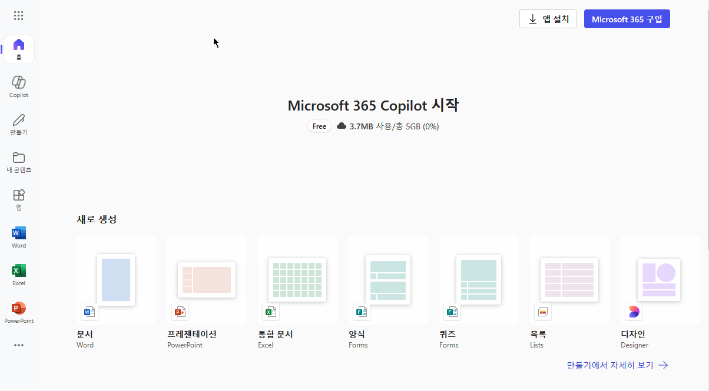

# 6. 현업에서의 용어 노하우 💼

## 목차
- [6. 현업에서의 용어 노하우 💼](#6-현업에서의-용어-노하우-)
  - [목차](#목차)
  - [Version Control: 코드 변경사항 추적과 협업의 핵심 🔄](#version-control-코드-변경사항-추적과-협업의-핵심-)
    - [Version Control의 대표: Git](#version-control의-대표-git)
  - [기획과 플로우차트: 개발 전 아이디어 구조화하기 📊](#기획과-플로우차트-개발-전-아이디어-구조화하기-)
    - [상세 플로우차트 예시](#상세-플로우차트-예시)
  - [오픈 소스(Open Source): 공유와 협력의 개발 문화 🌍](#오픈-소스open-source-공유와-협력의-개발-문화-)
    - [주요 오픈 소스 라이선스 비교](#주요-오픈-소스-라이선스-비교)
  - [클라우드: 확장 가능한 인프라의 새로운 패러다임 ☁️](#클라우드-확장-가능한-인프라의-새로운-패러다임-️)
    - [클라우드를 도입하는 이유](#클라우드를-도입하는-이유)
      - [전통적인 실물 서버의 단점](#전통적인-실물-서버의-단점)
      - [클라우드의 장점](#클라우드의-장점)
  - [SaaS(Software as a Service): 구독형 소프트웨어의 시대 📦](#saassoftware-as-a-service-구독형-소프트웨어의-시대-)
    - [SaaS의 주요 특징](#saas의-주요-특징)
    - [대표적인 SaaS 서비스 예시](#대표적인-saas-서비스-예시)

---

## Version Control: 코드 변경사항 추적과 협업의 핵심 🔄

**Version Control**은 코드의 변경사항을 추적하고, 협업을 위한 도구로 사용된다. 코드의 변경사항을 추적하면 코드의 이전 버전으로 돌아갈 수 있고 여러 사람이 동시에 작업할 때 충돌을 방지할 수 있다. 버전 컨트롤은 다양한 도구로 제공되지만 소프트웨어 개발에서는 **Git**을 가장 많이 사용한다.

```mermaid
gitGraph
    commit id: "초기 코드"
    branch feature-login
    checkout feature-login
    commit id: "로그인 기능 추가"
    commit id: "로그인 UI 개선"
    checkout main
    merge feature-login
    branch bugfix
    checkout bugfix
    commit id: "버그 수정"
    checkout main
    merge bugfix
```

*Git 기반 버전 관리 워크플로우의 예시*

*그림 7: 위키 시스템 또한 Version Control의 예시로 볼 수 있다.*

### Version Control의 대표: Git

**Git**은 **리누스 토르발스(Linus Torvalds)** 가 개발한 분산 버전 관리 시스템으로, 소프트웨어 개발에서 가장 많이 사용되는 버전 관리 시스템이다. 누가 코드를 작성했는지 확인 가능하고 협업에 용이하다.

branch 기능을 활용해 서로 다른 목적의 버전을 동시에 개발하거나, 충돌하는 코드를 병합하거나, 얼마든지 이전 버전으로 돌아가 개발하는 등의 편의성을 제공한다.

> 💡 **알아두면 좋은 팁**: 
> Git과 GitHub은 다른 개념입니다. Git은 버전 관리 시스템이고, GitHub은 Git 저장소를 호스팅하는 웹 서비스입니다.

---

## 기획과 플로우차트: 개발 전 아이디어 구조화하기 📊

**기획과 플로우차트**는 서비스를 만들기에 앞서 어떤 서비스를 만들 것인지에 대한 핵심적인 흐름을 데이터와 함께 보여준다.

```mermaid
flowchart LR
    A[사용자 방문] -->|상품 검색 및 선택| B[상품 구매]
    B -->|결제 완료| C[상품 배송]
    
    style A fill:#f9d5e5,stroke:#333,stroke-width:2px
    style B fill:#b5ead7,stroke:#333,stroke-width:2px
    style C fill:#c7ceea,stroke:#333,stroke-width:2px
```
*해당 그림은 CD 쇼핑몰의 프로세스를 예시로 든 것이다*

처음 CD 쇼핑몰을 개발하는 개발자가 다음과 같은 프로세스를 예시로 작성했다고 가정하자. 그러나 해당 프로세스엔 누가 상품을 구매했는지, 어디로 상품을 보내야 하는지에 대한 **정보 획득 과정**이 없다. 이를 해결하기 위해 개발자는 **로그인 과정**을 추가하기로 했다.

```mermaid
flowchart LR
    A[사용자 방문] -->|회원가입/로그인| B[로그인]
    B -->|상품 검색 및 선택| C[상품 구매]
    C -->|결제 완료| D[상품 배송]
    
    style A fill:#f9d5e5,stroke:#333,stroke-width:2px
    style B fill:#ffdac1,stroke:#333,stroke-width:2px
    style C fill:#b5ead7,stroke:#333,stroke-width:2px
    style D fill:#c7ceea,stroke:#333,stroke-width:2px
```
*로그인 과정을 추가한 CD 쇼핑몰 프로세스*

이렇게 비즈니스 로직과 프로세스를 간단하게 설계해 놓은 것을 **프로토타입**이라고 하는데, 이는 개발자와 기획자가 서로 의견을 나누고 수정할 수 있는 기회를 제공한다. 프로토타입 이후, 기획팀은 상세기획을 시작하고 개발자는 관련 레퍼런스, 활용 라이브러리, API 등을 점검한다.

### 상세 플로우차트 예시

```mermaid
flowchart TD
    A[사용자 로그인] -->|카테고리/검색| B[CD 상품 탐색]
    B -->|상품 선택| C[상세 정보 확인]
    C -->|장바구니 추가| D[장바구니 확인]
    D -->|결제 진행| E[주문 및 결제]
    E -->|주문 확인| F[배송 처리]
    F -->|배송 완료| G[상품 수령]
    
    G -->|상품 불만족| H[환불 요청]
    H -->|환불 검토| I[환불 처리]
    I -->|환불 완료| J[환불금 입금]
    
    G -->|상품 만족| K[구매 완료]
    K -->|리뷰 작성| L[리뷰 등록]
    
    style A fill:#f9d5e5,stroke:#333,stroke-width:2px
    style E fill:#b5ead7,stroke:#333,stroke-width:2px
    style F fill:#c7ceea,stroke:#333,stroke-width:2px
    style G fill:#ffdac1,stroke:#333,stroke-width:2px
    style H fill:#e2f0cb,stroke:#333,stroke-width:2px
    style I fill:#ffb7b2,stroke:#333,stroke-width:2px
    style K fill:#a0ced9,stroke:#333,stroke-width:2px
```

*CD 쇼핑몰로 표현한 상세 플로우차트의 예시*

> 💡 **핵심 포인트**: 
> 플로우차트는 개발 전 단계에서 서비스의 로직을 명확히 하고, 모든 팀원이 같은 비전을 공유하는 데 중요한 역할을 합니다.

---

## 오픈 소스(Open Source): 공유와 협력의 개발 문화 🌍

**오픈 소스(Open Source)** 는 프로젝트 전체 코드가 공개되어 오픈 소스 라이선스에 따라 활용할 수 있는 코드 소스이다. 오픈 소스는 **공유와 협력**을 중요시하는 개발 문화를 형성하며, **소프트웨어의 품질 향상**과 **개발 속도 향상**에 기여한다. Google의 안드로이드 운영체제 등이 대표적인 오픈 소스 프로젝트이고, GitHub에도 수많은 오픈 소스 프로젝트가 공유되어 있다.

### 주요 오픈 소스 라이선스 비교

| 라이선스 | 유형 | 주요 특징 | 대표 프로젝트 예시 |
|:--------:|:----:|:--------:|:----------------:|
| **MIT** | 허용적 | 가장 자유로운 라이선스, 저작권 표시만 유지하면 자유롭게 사용/수정/배포 가능 | jQuery, Node.js, React |
| **Apache 2.0** | 허용적 | 특허권 제공 조항 포함, 수정 파일 명시 필요 | Android, Kubernetes, TensorFlow |
| **GPL 3.0** | 엄격한 카피레프트 | 파생 저작물도 동일 라이선스로 공개 필수(강한 카피레프트) | Linux 커널, Git, WordPress |
| **LGPL 3.0** | 약한 카피레프트 | 라이브러리 링크만 하는 경우 소스 공개 의무 없음 | LibreOffice, FFmpeg |
| **BSD** | 허용적 | 저작권 고지와 면책 조항만 유지하면 됨 | FreeBSD, Nginx |

> ⚠️ **주의사항**: 
> 오픈 소스 소프트웨어를 사용할 때는 해당 라이선스 조건을 반드시 확인하고 준수해야 합니다. 특히 상업적 목적으로 사용할 경우 더욱 중요합니다.

---

## 클라우드: 확장 가능한 인프라의 새로운 패러다임 ☁️

클라우드는 직접 실물 서버를 구축하지 않고 인터넷을 통해 서버와 소프트웨어를 활용할 수 있는 서비스를 의미한다.

```mermaid
graph TD
    A[클라우드 컴퓨팅] --> B[IaaS]
    A --> C[PaaS]
    A --> D[SaaS]
    A --> E[FaaS]
    
    B --> B1[인프라 제공]
    C --> C1[개발 플랫폼 제공]
    D --> D1[소프트웨어 제공]
    E --> E1[서버리스 함수 제공]
    
    style A fill:#f9d5e5,stroke:#333,stroke-width:2px
    style B fill:#b5ead7,stroke:#333,stroke-width:2px
    style C fill:#c7ceea,stroke:#333,stroke-width:2px
    style D fill:#ffdac1,stroke:#333,stroke-width:2px
    style E fill:#e2f0cb,stroke:#333,stroke-width:2px
```

*클라우드 서비스 모델의 종류*

### 클라우드를 도입하는 이유

#### 전통적인 실물 서버의 단점

1. 용량 확장과 운영을 유연하게 하기 힘들고
2. 한번 서버를 설치하면 계속 유지하는 비용이 들고
3. 서버 설계에 실패할 경우 추가 비용이 든다

#### 클라우드의 장점

1. 유연한 설계가 가능하고 필요에 따라 서비스 스펙을 조절할 수 있으며
2. 사용한 만큼 비용을 지불하고
3. 365일 정상적으로 서비스를 제공하기 위한 노력을 클라우드 업체가 대신해주기 때문에 안정적인 서비스를 제공할 수 있다.

| 클라우드 서비스 | 특징 | 대표적인 서비스 |
|:---------------:|:----:|:-------------:|
| **AWS (Amazon Web Services)** | 가장 큰 시장 점유율, 다양한 서비스 제공 | EC2, S3, Lambda |
| **Microsoft Azure** | 기업 환경과의 통합 강점 | Azure VM, Azure Blob Storage |
| **Google Cloud Platform** | 데이터 분석, AI 분야에 강점 | Compute Engine, BigQuery |
| **IBM Cloud** | 엔터프라이즈 중심 서비스 | Watson, Cloud Foundry |
| **Oracle Cloud** | 데이터베이스 솔루션 강점 | Oracle Database Cloud |

---

## SaaS(Software as a Service): 구독형 소프트웨어의 시대 📦

**SaaS(Software as a Service)** 는 소프트웨어를 구독 형태로 제공하는 서비스를 의미한다. 사용자는 소프트웨어를 구매하는 것이 아닌 **구독**하여 사용하며, 직접 설치하지 않고도 **웹 브라우저**를 통해 소프트웨어를 사용할 수 있다.

### SaaS의 주요 특징

- **클라우드 기반**: 중앙 서버에서 호스팅되고 인터넷을 통해 접근
- **구독 모델**: 일회성 구매가 아닌 정기 구독 방식
- **자동 업데이트**: 사용자가 별도로 업데이트를 설치할 필요 없음
- **다중 디바이스 접근**: 다양한 기기에서 동일한 서비스 이용 가능
- **확장성**: 사용자 및 기능 확장이 용이함

*그림 8: SaaS의 예시인 Microsoft 365*

### 대표적인 SaaS 서비스 예시

| 분야 | 서비스 예시 | 주요 기능 |
|:----:|:----------:|:--------:|
| **문서 작업** | Microsoft 365, Google Workspace | 문서 작성, 스프레드시트, 프레젠테이션 |
| **디자인** | Adobe Creative Cloud | 사진 편집, 그래픽 디자인, 비디오 편집 |
| **프로젝트 관리** | Jira, Asana, Trello | 프로젝트 추적, 작업 할당, 협업 |
| **고객 관계 관리** | Salesforce, HubSpot | 고객 데이터 관리, 영업 추적, 마케팅 자동화 |
| **커뮤니케이션** | Slack, Microsoft Teams | 메시징, 화상 회의, 파일 공유 |

> 💡 **비즈니스 인사이트**: 
> SaaS 모델은 기업에게는 예측 가능한 수익 흐름을, 사용자에게는 초기 비용 절감과 최신 기능 접근성을 제공합니다.